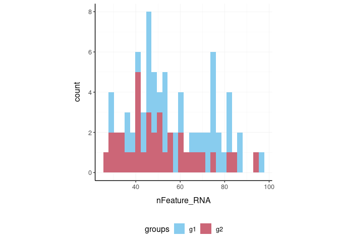
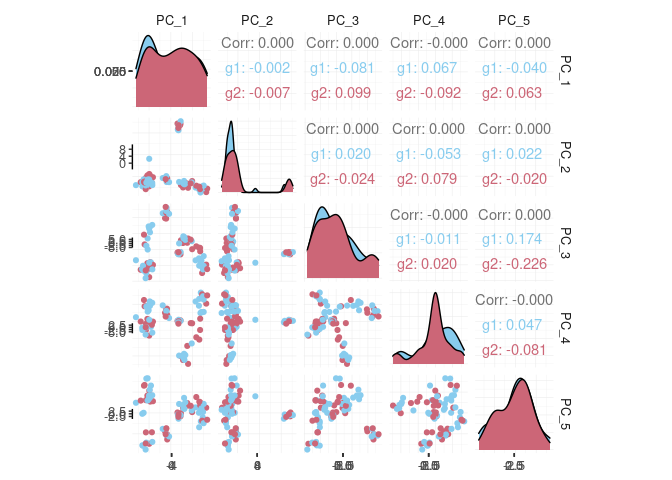
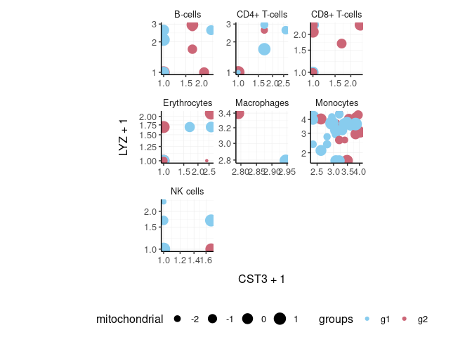

tidyseurat - part of tidyTranscriptomics
================

<!-- badges: start -->

[](https://www.tidyverse.org/lifecycle/#maturing)
[](https://github.com/stemangiola/tidyseurat/actions)
<!-- badges: end -->

**Brings Seurat to the tidyverse\!**

website:
[stemangiola.github.io/tidyseurat/](http://stemangiola.github.io/tidyseurat/)

Please have a look also to

  - [tidybulk](https://github.com/stemangiola/tidybulk) for tidy
    high-level data analysis and manipulation
  - [nanny](https://github.com/stemangiola/nanny) for tidy high-level
    data analysis and manipulation
  - [tidygate](https://github.com/stemangiola/tidygate) for adding
    custom gate information to your tibble
  - [tidyHeatmap](https://github.com/stemangiola/tidyHeatmap) for
    heatmaps produced with tidy principles

<!---

[](https://travis-ci.org/stemangiola/tidyseurat) [](https://coveralls.io/github/stemangiola/tidyseurat?branch=master)

-->

## Installation

From CRAN (in submission)

``` r
install.packages("tidyseurat")
```

From Github

``` r
devtools::install_github("stemangiola/tidyseurat")
```

## Create `tidyseurat`, the best of both worlds\!

This is a seurat object but it is evaluated as tibble. So it is fully
compatible both with Seurat and tidyverse APIs.

``` r
pbmc_small_tidy = tidyseurat::pbmc_small %>% tidy()
```

**It looks like a tibble**

``` r
pbmc_small_tidy
```

    ## # A tibble: 80 x 15
    ##    cell  orig.ident nCount_RNA nFeature_RNA RNA_snn_res.0.8 letter.idents groups
    ##    <chr> <fct>           <dbl>        <int> <fct>           <fct>         <chr> 
    ##  1 ATGC… SeuratPro…         70           47 0               A             g2    
    ##  2 CATG… SeuratPro…         85           52 0               A             g1    
    ##  3 GAAC… SeuratPro…         87           50 1               B             g2    
    ##  4 TGAC… SeuratPro…        127           56 0               A             g2    
    ##  5 AGTC… SeuratPro…        173           53 0               A             g2    
    ##  6 TCTG… SeuratPro…         70           48 0               A             g1    
    ##  7 TGGT… SeuratPro…         64           36 0               A             g1    
    ##  8 GCAG… SeuratPro…         72           45 0               A             g1    
    ##  9 GATA… SeuratPro…         52           36 0               A             g1    
    ## 10 AATG… SeuratPro…        100           41 0               A             g1    
    ## # … with 70 more rows, and 8 more variables: RNA_snn_res.1 <fct>, PC_1 <dbl>,
    ## #   PC_2 <dbl>, PC_3 <dbl>, PC_4 <dbl>, PC_5 <dbl>, tSNE_1 <dbl>, tSNE_2 <dbl>

**But it is a seurat object afterall**

``` r
pbmc_small_tidy@assays
```

    ## $RNA
    ## Assay data with 230 features for 80 cells
    ## Top 10 variable features:
    ##  PPBP, IGLL5, VDAC3, CD1C, AKR1C3, PF4, MYL9, GNLY, TREML1, CA2

## Preliminary plots

We can treat `pbmc_small_tidy` effectively as a normal tibble.

Here we plot number of transcripts per cell

``` r
pbmc_small_tidy %>%
  tidyseurat::ggplot(aes(nFeature_RNA, fill=groups)) + 
  geom_histogram() +
  my_theme
```

<!-- -->

Here we plot total transcriptional material per cell

``` r
pbmc_small_tidy %>%
  tidyseurat::ggplot(aes(groups, nCount_RNA, fill=groups)) + 
  geom_boxplot(outlier.shape = NA) +
  geom_jitter(width = 0.1) +
  my_theme
```

<!-- -->

Here we plot abundance of two transcripts for each group

``` r
pbmc_small_tidy %>% 
  join_transcripts(transcripts = c("HLA-DRA" ,     "LYZ" )) %>%
  ggplot(aes(groups, abundance_RNA + 1, fill=groups)) + 
  geom_boxplot(outlier.shape = NA) + 
  geom_jitter(aes(size=nCount_RNA), alpha=0.5, width = 0.2) + 
  scale_y_log10() + 
  my_theme
```

<!-- -->

## Preprocess the dataset

Also you can treat the object as Seurat object and proceed with data
processing.

``` r
pbmc_small_pca = 
  pbmc_small_tidy %>%
  SCTransform(verbose = FALSE) %>% 
  FindVariableFeatures(verbose = FALSE) %>% 
  RunPCA(verbose = FALSE)

pbmc_small_pca
```

    ## # A tibble: 80 x 17
    ##    cell  orig.ident nCount_RNA nFeature_RNA RNA_snn_res.0.8 letter.idents groups
    ##    <chr> <fct>           <dbl>        <int> <fct>           <fct>         <chr> 
    ##  1 ATGC… SeuratPro…         70           47 0               A             g2    
    ##  2 CATG… SeuratPro…         85           52 0               A             g1    
    ##  3 GAAC… SeuratPro…         87           50 1               B             g2    
    ##  4 TGAC… SeuratPro…        127           56 0               A             g2    
    ##  5 AGTC… SeuratPro…        173           53 0               A             g2    
    ##  6 TCTG… SeuratPro…         70           48 0               A             g1    
    ##  7 TGGT… SeuratPro…         64           36 0               A             g1    
    ##  8 GCAG… SeuratPro…         72           45 0               A             g1    
    ##  9 GATA… SeuratPro…         52           36 0               A             g1    
    ## 10 AATG… SeuratPro…        100           41 0               A             g1    
    ## # … with 70 more rows, and 10 more variables: RNA_snn_res.1 <fct>,
    ## #   nCount_SCT <dbl>, nFeature_SCT <int>, PC_1 <dbl>, PC_2 <dbl>, PC_3 <dbl>,
    ## #   PC_4 <dbl>, PC_5 <dbl>, tSNE_1 <dbl>, tSNE_2 <dbl>

If a tool is not included in the tidyseurat collection, we can use
`as_tibble` to permanently convert `tidyseurat` into tibble

``` r
pbmc_small_pca %>%
  as_tibble %>%
  select(contains("PC"), everything()) %>%
      GGally::ggpairs(columns = 1:5, ggplot2::aes(colour=groups))
```

<!-- -->

## Identify clusters

We proceed with cluster identification

``` r
pbmc_small_cluster = 
  pbmc_small_pca %>%
  FindNeighbors(verbose=FALSE) %>% 
  FindClusters(method = "igraph", verbose=FALSE )

pbmc_small_cluster
```

    ## # A tibble: 80 x 19
    ##    cell  orig.ident nCount_RNA nFeature_RNA RNA_snn_res.0.8 letter.idents groups
    ##    <chr> <fct>           <dbl>        <int> <fct>           <fct>         <chr> 
    ##  1 ATGC… SeuratPro…         70           47 0               A             g2    
    ##  2 CATG… SeuratPro…         85           52 0               A             g1    
    ##  3 GAAC… SeuratPro…         87           50 1               B             g2    
    ##  4 TGAC… SeuratPro…        127           56 0               A             g2    
    ##  5 AGTC… SeuratPro…        173           53 0               A             g2    
    ##  6 TCTG… SeuratPro…         70           48 0               A             g1    
    ##  7 TGGT… SeuratPro…         64           36 0               A             g1    
    ##  8 GCAG… SeuratPro…         72           45 0               A             g1    
    ##  9 GATA… SeuratPro…         52           36 0               A             g1    
    ## 10 AATG… SeuratPro…        100           41 0               A             g1    
    ## # … with 70 more rows, and 12 more variables: RNA_snn_res.1 <fct>,
    ## #   nCount_SCT <dbl>, nFeature_SCT <int>, SCT_snn_res.0.8 <fct>,
    ## #   seurat_clusters <fct>, PC_1 <dbl>, PC_2 <dbl>, PC_3 <dbl>, PC_4 <dbl>,
    ## #   PC_5 <dbl>, tSNE_1 <dbl>, tSNE_2 <dbl>

Now we can interrogate the object as if it was a regular tibble data
frame

``` r
pbmc_small_cluster %>%
  tidyseurat::count(groups, seurat_clusters)
```

    ## # A tibble: 8 x 3
    ## # Groups:   groups [2]
    ##   groups seurat_clusters     n
    ##   <chr>  <fct>           <int>
    ## 1 g1     0                  17
    ## 2 g1     1                  14
    ## 3 g1     2                   9
    ## 4 g1     3                   4
    ## 5 g2     0                  13
    ## 6 g2     1                  12
    ## 7 g2     2                   6
    ## 8 g2     3                   5

We can identify cluster markers using Seurat

``` r
# Identify markers
markers = 
  pbmc_small_cluster %>% 
  FindAllMarkers(only.pos = TRUE, min.pct = 0.25, thresh.use = 0.25) %>%
  group_by(cluster) %>%
  top_n(10, avg_logFC)

# Plot heatmap
pbmc_small_cluster %>%
  DoHeatmap(features = markers$gene) 
```

<!-- -->

## Reduce dimensions

We can calculate the first 3 UMAP dimensions using Seurat framework

``` r
pbmc_small_UMAP = 
  pbmc_small_cluster %>%
  RunUMAP(reduction = "pca", dims = 1:15, n.components = 3L, )
```

and we can plot them using 3D plot using plotly

``` r
pbmc_small_UMAP %>%
    plot_ly(
        x = ~`UMAP_1`,
        y = ~`UMAP_2`, 
        z = ~`UMAP_3`,
        color = ~ seurat_clusters
    ) 
```


## Cell type prediction

We can infer cell type identities using singleR

``` r
blueprint = SingleR::BlueprintEncodeData()

cell_type_df = 
  pbmc_small_UMAP@assays[["SCT"]]@counts %>% 
  log1p %>%
  Matrix::Matrix(sparse = TRUE) %>%
 SingleR::SingleR(
     ref = blueprint ,
     labels = blueprint$label.main,
     method = "single"
 ) %>%
  as.data.frame() %>%
  as_tibble(rownames="cell") %>% 
  select(cell, first.labels)
```

``` r
pbmc_small_cell_type =
  pbmc_small_UMAP %>%
  left_join(cell_type_df, by="cell")

pbmc_small_cell_type %>%
  tidyseurat::select(cell, first.labels, everything())
```

    ## # A tibble: 80 x 23
    ##    cell  first.labels orig.ident nCount_RNA nFeature_RNA RNA_snn_res.0.8
    ##    <chr> <chr>        <fct>           <dbl>        <int> <fct>          
    ##  1 ATGC… CD4+ T-cells SeuratPro…         70           47 0              
    ##  2 CATG… CD8+ T-cells SeuratPro…         85           52 0              
    ##  3 GAAC… CD8+ T-cells SeuratPro…         87           50 1              
    ##  4 TGAC… CD4+ T-cells SeuratPro…        127           56 0              
    ##  5 AGTC… CD4+ T-cells SeuratPro…        173           53 0              
    ##  6 TCTG… CD4+ T-cells SeuratPro…         70           48 0              
    ##  7 TGGT… CD4+ T-cells SeuratPro…         64           36 0              
    ##  8 GCAG… CD4+ T-cells SeuratPro…         72           45 0              
    ##  9 GATA… CD4+ T-cells SeuratPro…         52           36 0              
    ## 10 AATG… CD4+ T-cells SeuratPro…        100           41 0              
    ## # … with 70 more rows, and 17 more variables: letter.idents <fct>,
    ## #   groups <chr>, RNA_snn_res.1 <fct>, nCount_SCT <dbl>, nFeature_SCT <int>,
    ## #   SCT_snn_res.0.8 <fct>, seurat_clusters <fct>, PC_1 <dbl>, PC_2 <dbl>,
    ## #   PC_3 <dbl>, PC_4 <dbl>, PC_5 <dbl>, tSNE_1 <dbl>, tSNE_2 <dbl>,
    ## #   UMAP_1 <dbl>, UMAP_2 <dbl>, UMAP_3 <dbl>

We can easily summarise the results. For example, see how cell type
classification overlaps with cluster classification.

``` r
pbmc_small_cell_type %>%
  count(seurat_clusters, first.labels)
```

    ## # A tibble: 9 x 3
    ##   seurat_clusters first.labels     n
    ##   <fct>           <chr>        <int>
    ## 1 0               CD4+ T-cells     0
    ## 2 0               CD8+ T-cells     0
    ## 3 0               NK cells         0
    ## 4 1               Macrophages      0
    ## 5 1               Monocytes        0
    ## 6 2               B-cells          0
    ## 7 2               Macrophages      0
    ## 8 2               Monocytes        0
    ## 9 3               Erythrocytes     0

We can easily reshape the data for building information-rish faceted
plots

``` r
pbmc_small_cell_type %>%
  
  # Reshaping
  pivot_longer(
    cols=c(seurat_clusters, first.labels), 
    names_to = "classifier", values_to = "label"
  ) %>%
  
  # Plotting
  ggplot(aes(UMAP_1, UMAP_2, color=label)) +
  geom_point() +
  facet_wrap(~classifier) +
  my_theme
```

<!-- -->

We can easily plot gene correlation per cell category, adding
multi-layer annotations

``` r
pbmc_small_cell_type %>% 
  
  # Add mitochondrial abundance
  mutate(mitochondrial = rnorm(n())) %>%
  
  # Plot correlation
  join_transcripts(transcripts = c("CST3" ,     "LYZ" ), shape = "wide") %>%
  ggplot(aes(CST3 +1, LYZ + 1, color=groups, size=mitochondrial)) +
  geom_point() + 
  facet_wrap(~first.labels, scales = "free") +
  scale_x_log10() +
  scale_y_log10() +
  my_theme
```

<!-- --> \#\# Nested analyses A
powerful tool we can use with tidyseurat is `nest`. We can easily
perform independent analyses on subsets of the dataset. First we
classify cell types in lymphoid and myeloid; then, nest based on the new
classification

``` r
pbmc_small_nested = 
  pbmc_small_cell_type %>%
  filter(first.labels != "Erythrocytes") %>%
  mutate(cell_class = if_else(`first.labels` %in% c("Macrophages", "Monocytes"), "myeloid", "lmphoid")) %>%
  nest(data = -cell_class)

pbmc_small_nested
```

    ## # A tibble: 2 x 2
    ##   cell_class data      
    ##   <chr>      <list>    
    ## 1 lmphoid    <tidysert>
    ## 2 myeloid    <tidysert>

Now we can independently (i) find variable features, (ii) reduce
dimensions, and (iii) cluster. Using both tidyverse and Seurat seamlessy

``` r
pbmc_small_nested_reanalysed = 
  pbmc_small_nested %>%
  mutate(data = map(
    data, ~ .x %>% 
      FindVariableFeatures(verbose = FALSE) %>%
      RunPCA(npcs = 10, verbose = FALSE) %>%
      FindNeighbors(verbose = FALSE) %>% 
      FindClusters(method = "igraph" , verbose = FALSE) %>% 
      RunUMAP(reduction = "pca", dims = 1:10, n.components = 3L, verbose = FALSE)
  )) 

pbmc_small_nested_reanalysed
```

    ## # A tibble: 2 x 2
    ##   cell_class data      
    ##   <chr>      <list>    
    ## 1 lmphoid    <tidysert>
    ## 2 myeloid    <tidysert>

Now we can unnest and plot the new clasification

``` r
pbmc_small_nested_reanalysed %>%
  
  # Convert to tibble otherwise Seurat drops reduced dimensions when unifying data sets.
  mutate(data = map(data, ~ .x %>% as_tibble)) %>%
  unnest(data) %>%

  # Define unique clusters
  unite("cluster", c(cell_class, seurat_clusters), remove=FALSE) %>%
  
  # Plotting
  ggplot(aes(UMAP_1, UMAP_2, color=cluster)) +
  geom_point() +
  facet_wrap(~cell_class) +
  my_theme
```

<!-- -->
